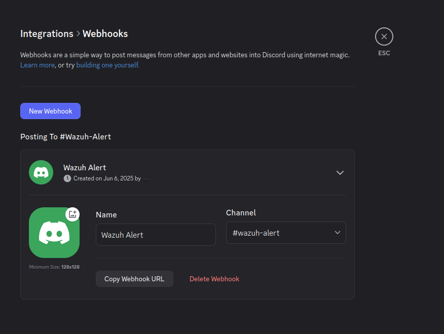
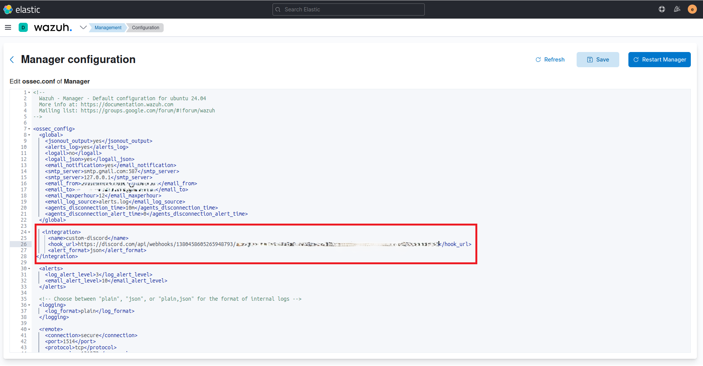
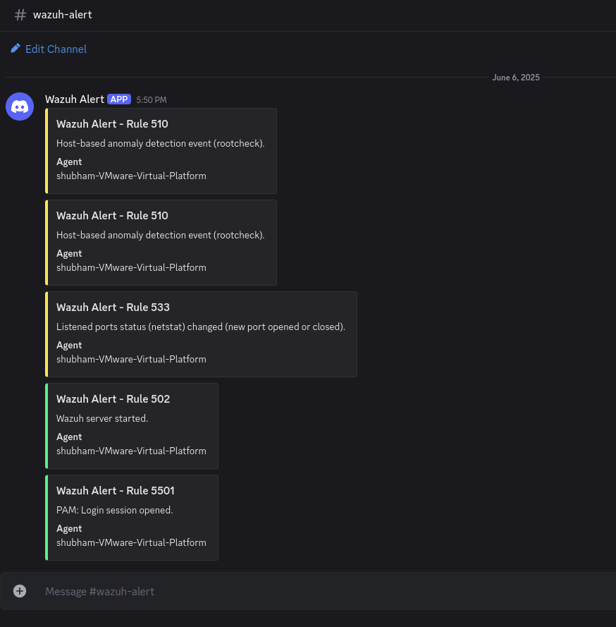
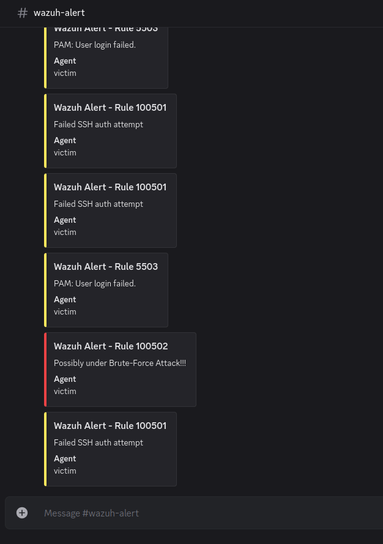

# 💬 Discord Alerting
This section describes how I configured Wazuh to forward high-severity alerts directly to a Discord channel using webhooks.

---
## 💡 Why Use Discord for Alerting?
- Real-time push notifications to your phone/desktop
- Great for personal or small-team SOC lab environments
- Easy to integrate with Wazuh using webhooks

---
## 🔧 Steps I Followed
1. Created a Discord Webhook
   - I created a private Discord server with a dedicated alerts channel.
   - Then, I created a webhook URL by:
     - Going to channel settings → Integrations → Webhooks → New Webhook
     - Copied the webhook URL for later use.

  
    
2. Created a Custom Integration Script

I followed the steps from this tutorial: 👉 [LearnToHomeLab – EP19: Wazuh Discord Alerts](https://www.learntohomelab.com/homelabseries/EP19_wazuhdiscordalerts/)

Here’s a slightly modified version of the Python script I used:
```bash
#/usr/bin/env python3

import sys
import requests
import json
from requests.auth import HTTPBasicAuth

"""
ossec.conf configuration structure
 <integration>
     <name>custom-discord</name>
     <hook_url>https://discord.com/api/webhooks/XXXXXXXXXXX</hook_url>
     <alert_format>json</alert_format>
 </integration>
"""

# read configuration
alert_file = sys.argv[1]
user = sys.argv[2].split(":")[0]
hook_url = sys.argv[3]

# read alert file
with open(alert_file) as f:
    alert_json = json.loads(f.read())

# extract alert fields
alert_level = alert_json["rule"]["level"]

# colors from https://gist.github.com/thomasbnt/b6f455e2c7d743b796917fa3c205f812
if(alert_level >= 5 and alert_level <= 7):
    # yellow
    color = "16705372"
else:
    # red
    color = "15548997"

# agent details
if "agentless" in alert_json:
          agent_ = "agentless"
else:
    agent_ = alert_json["agent"]["name"]

if(alert_level > 5):
    # combine message details
    payload = json.dumps({
        "content": "",
        "embeds": [
            {
                        "title": f"Wazuh Alert - Rule {alert_json['rule']['id']}",
                                    "color": color,
                                    "description": alert_json["rule"]["description"],
                                    "fields": [{
                                                    "name": "Agent",
                                                    "value": agent_,
                                                    "inline": True
                                                    }]
            }
        ]
    })

    # send message to discord
    r = requests.post(hook_url, data=payload, headers={"content-type": "application/json"})
sys.exit(0)
```


3. Made the Script Executable
```bash
sudo chmod +x /var/ossec/integrations/discord.py
```

4. Edited `ossec.conf`

Added a custom integration under `<integration>`:
```bash
<integration>
     <name>custom-discord</name>
     <hook_url>https://discord.com/api/webhooks/XXXXXXXXXXXXXXX/hook_url>
     <alert_format>json</alert_format>
 </integration>
```
*Replace the webhook URL with your own.*



5. Lastly, we need to restart Wazuhs controls:
`sudo /var/ossec/bin/wazuh-control restart`

It sends a few alerts in the Discord channel when its restarting confirming that the setup was successfulll.



6. Tested the Integration

I triggered a test alert from my custom brute-force detection rule (100502) and ✅ the message was sent to my Discord alerts channel successfully.



---
## 🧾 Summary

Using Discord for alerting helped me replicate real-time security notifications within my SOC lab. It's a lightweight and effective method for monitoring important events instantly.
