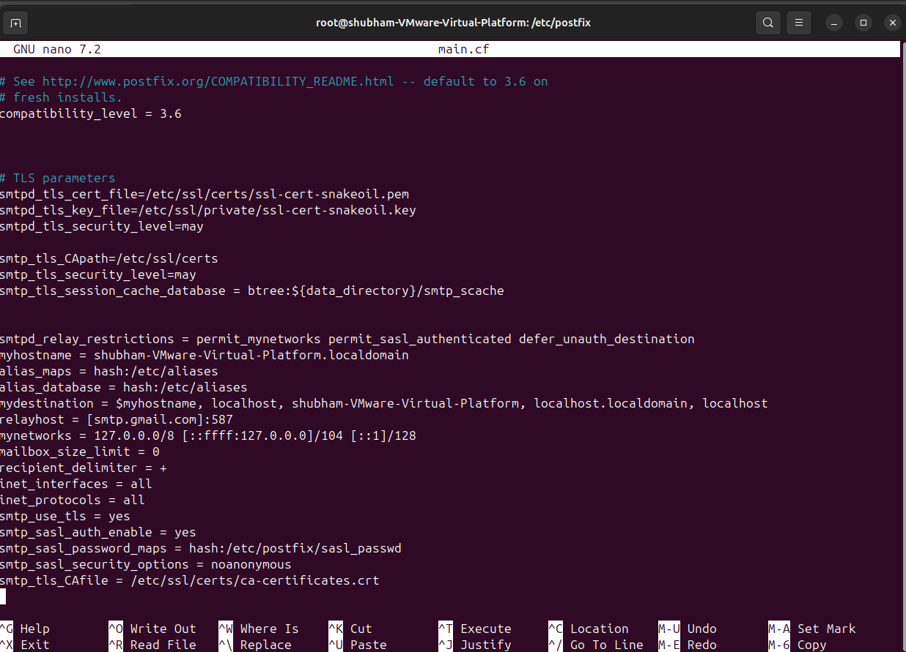
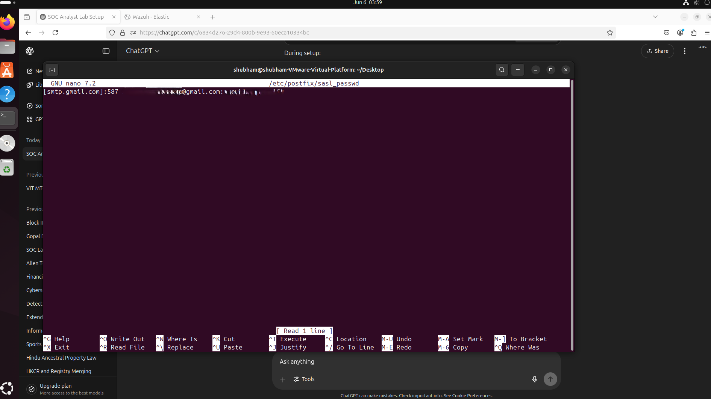
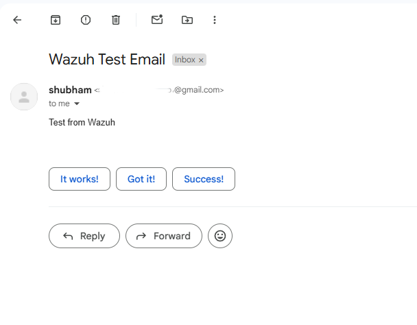
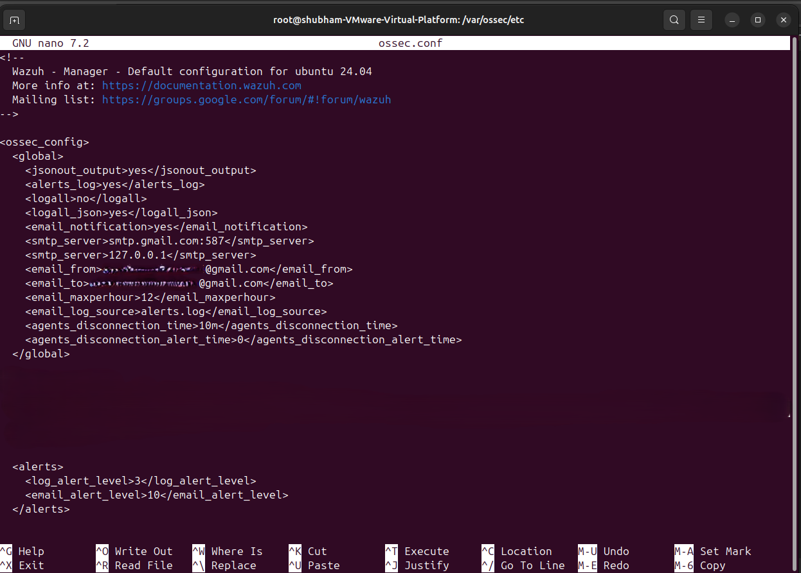
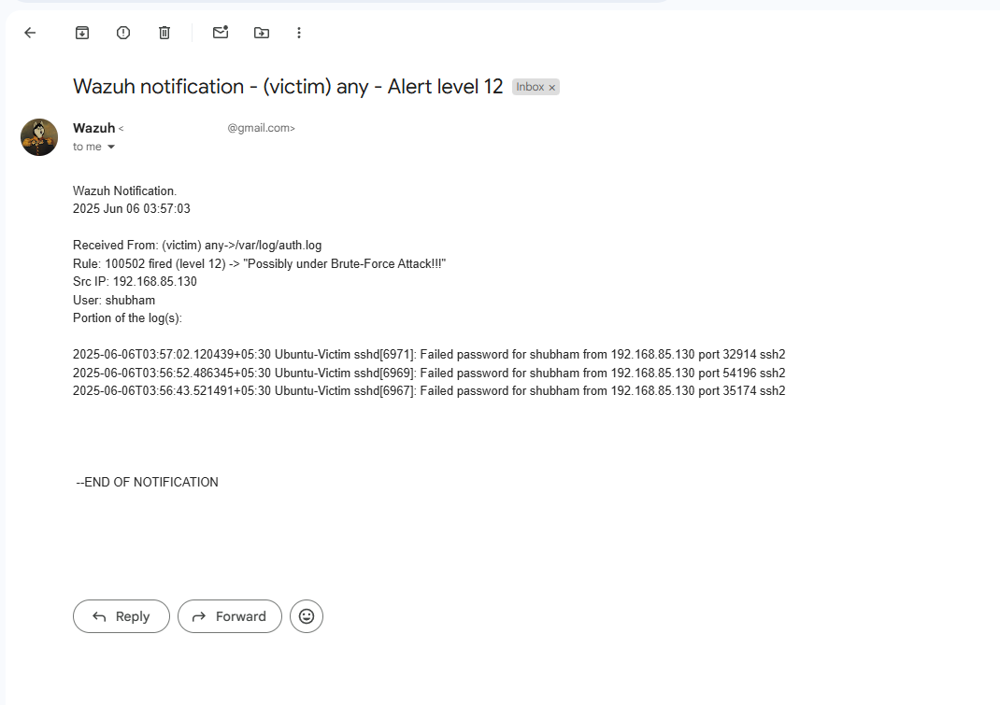

# 📧 Email Alerting via Gmail 
In this section, I configured Postfix to relay Wazuh alerts via Gmail SMTP. This allows me to get real-time notifications when a high-severity alert is generated.

---
## 🧠 Why Email Alerting?
- Get notified instantly for critical events
- Monitor your SOC lab even when away from the dashboard
- Helps simulate a real-world SOC alerting mechanism

---
## 🛠️ Steps I Followed
1. Installed Postfix
   On the Wazuh + ELK server:
   ```bash
   sudo apt update
   sudo apt install mailutils postfix -y
   ```
   During setup, I selected:
   - "Internet Site"
   - System mail name: `localhost`

2. Configured Gmail SMTP in Postfix
Edited `/etc/postfix/main.cf` and added at the bottom:
```bash
relayhost = [smtp.gmail.com]:587
smtp_use_tls = yes
smtp_sasl_auth_enable = yes
smtp_sasl_security_options = noanonymous
smtp_sasl_password_maps = hash:/etc/postfix/sasl_passwd
smtp_tls_CAfile = /etc/ssl/certs/ca-certificates.crt
```


3. Created Authentication File
Created `/etc/postfix/sasl_passwd` with:
```bash
[smtp.gmail.com]:587 your-email@gmail.com:your-app-password
```
**Replace your-app-password with your Google App Password**



Then:
```bash
sudo postmap /etc/postfix/sasl_passwd
sudo chmod 600 /etc/postfix/sasl_passwd /etc/postfix/sasl_passwd.db
```

4. Restarted Postfix
```bash
sudo systemctl restart postfix
```

5. Tested the Email Setup
```bash
echo "Test email from Wazuh SOC lab" | mail -s "Wazuh Test" your-email@gmail.com
```


✅ Email was received successfully.

6. Enabled Email Integration in Wazuh
Edited `/var/ossec/etc/ossec.conf` and added:
```bash
<global>
    <email_notification>yes</email_notification>
    <smtp_server> smtp.gmail.com:587 </smtp_server>
    <smtp_server> 127.0.0.1 </smtp_server>
    <email_from>"Email Origin"</email_from>
    <email_to>"Email Destination"</email_to>
    <email_maxperhour> 12 </email_maxperhour>
    <email_log_source>alerts.log</email_log_source>
</global>

<rule_alert>
   <email_alert_level> 10 </email_alert_level>
</rule_alert>
```


This ensures alerts with level ≥10 are emailed.

7. Restarted Wazuh Manager
```bash
sudo systemctl restart wazuh-manager
```

8. Verified Alert Delivery
I simulated a brute-force SSH attack, which triggered my custom rule (`100502`), and ✅ I received an alert email from Wazuh.



---
## 🧾 Summary
With Postfix configured to use Gmail SMTP, my Wazuh alerts now arrive directly in my inbox—replicating real-world SOC workflows and making my lab more practical and responsive.
