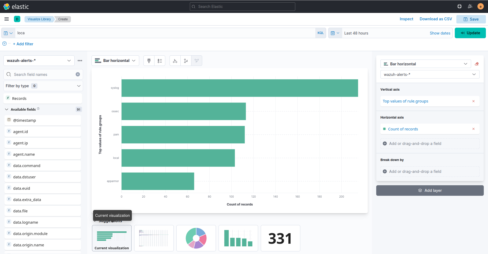
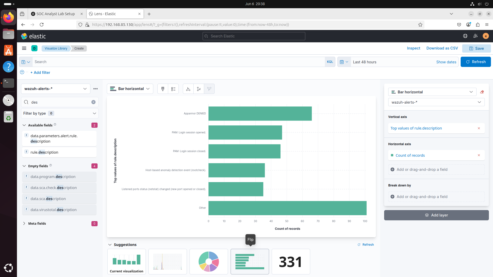
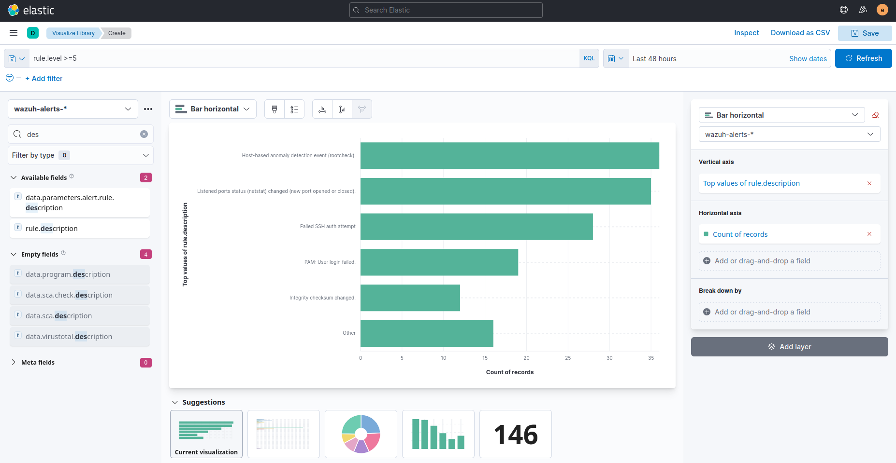
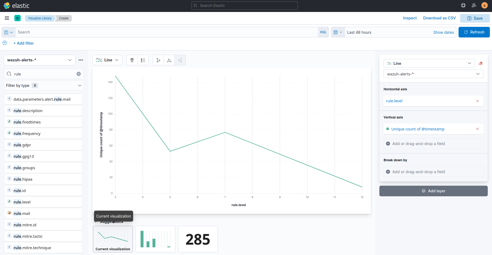

# 📊 Kibana Visualization
In this section, I configured dashboards in Kibana to visualize alerts, authentication logs, and attack patterns collected by Wazuh. This helps simulate how real-world SOC analysts monitor environments.

---
## 🧠 Why Use Kibana?
- Intuitive, real-time visualization of log data
- Easy filtering and querying with Lucene/KQL
- Helps track trends, spikes, and outliers
- Supports alert analysis and incident triage

 ---
 ## 🔧 Steps I Followed
 1. Accessed Kibana Dashboard
    I accessed the ELK Stack+Wazuh web interface using:
    ```bash
    http://<your-server-ip>
    ```
    - Logged in using the default credentials or those I had set.
    - Navigated to "Wazuh" → "Security Events".

  2. Used Prebuilt Dashboards
     Wazuh provides several prebuilt dashboards once integrated:
      - Overview
      - Security Events
      - Integrity Monitoring
      - Authentication Events
      - Alerts

     I explored these to understand:
      - Which rules are triggering
      - From which agents
      - Severity levels over time
  
---
## 📸 Example Visualizations



----



----



----




---
## 🧾 Summary
Kibana helped bring life to raw alerts by transforming them into visual intelligence. It enables pattern recognition and rapid SOC decision-making—making it an essential part of my home SOC lab setup.

